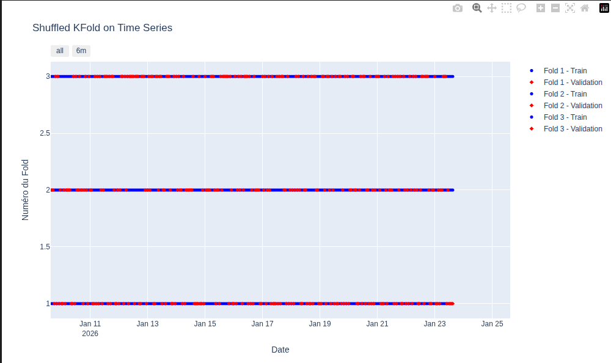
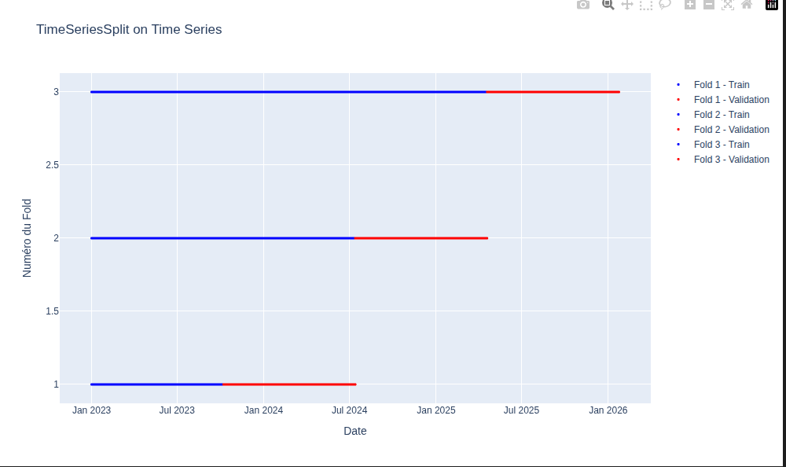

# Entre théorie et pratique autour d'un outil de prévision basé sur le gradient boosting

UBS - Sciences des données || 3 juin 2026
**Julien Gooris**

 

## Point de départ

Demande d'une entreprise (coopérative SICA - Prince de Bretagne) pour faire de la prévision agronomique appliquée à la production maraichère (tomates, choux, etc.) :
* **Horizon** de prévisions en semaines : $h \in \{1, \dots, 6\}$
* **Maille** : par variété (ex : cerise, grappe, cœur de bœuf et bio/conventionnel) $v$, au producteur (l'exploitation maraîchère) $p$,
* **Temporalité** ($t$) à deux niveaux : des campagnes de production (de mars à octobre) annuelles et des semaines de production 
* **Facteurs de production** complexes : ensoleillement, température, âge des plantes, type de serres, pratique des producteurs ($X_{v,p,t}$)
  
## Quelle grandeur prévoir ?

**Grandeur finale souhaitée** : la production de tomates $q_{v,p,t+h}$ (en tonnes) par variété, par producteur et pour dans *h* semaines

➡️ Etudions le processus pour savoir comment et s'il faut prévoir *directement* cette grandeur ou si des contraintes requirent de prévoir une *grandeur intermédiaire*
<!-- 
* **Grandeur intermédiaire** : la rendement de tomates par semaine $r_{v,p,t}$ (masse par m² et par semaine). Ensuite multiplié par les surfaces cultivées. -->

## Processus temporel
* **Le temps conditionne la prévision** : météo, âge des plantes, pratiques agricoles, variétés, formation des fruits, etc. évoluent dans le temps
  
  * Dépendance entre les semaines : $Q_{v,p,t} \text{ dépend de } Q_{v,p,t-k}$ pour $k \in \{1, \dots, \text{début de la campagne}\}$ (ex : âge des plantes, formation des fruits, etc.)
  * Indépendance entre les campagnes : $Q_{v,p,t} \text{ ne dépend pas de } Q_{v,p,t-k.\text{année}}$  
  
➡️ Traitement en série temporelle indispensable : non-échangeabilité des données, dont dépendances temporelles, au sein des campagnes

## Stationnarité

**Définition (stationnarité faible) :**
Pour un processus stochastique $\{Z_{t}\}$ : 
*  $\mathbb{E}[Z_{t}] = \mu \qquad \forall t$
*  $\mathbb{Var}[Z_{t}] = \sigma^2 \qquad \forall t$
*  $\text{Cov}(Z_{t}, Z_{t+h}) = \gamma(h) \qquad \forall t, \forall h< t$
  
Condition requise pour les modèles de prévision classiques (ARIMA, principales méthodes de ML) : les propriétés statistiques du processus ne changent pas au cours du temps

## Stationnarité conditionnelle
Ici le processsus et les modèles sont conditionnels aux facteurs de production (nos futurs régresseurs) $X_{v,p,t}$.
Plutôt que $Z_{t}$, on considère $Q_{v,p,t}=g(X_{v,p,t}, \epsilon_{v,p,t})$. 
La stationarité est alors définie par les propriétés suivantes :
  * $\mathbb{E}[q_{t}\mid X_{v,p,t}] = \mu({X_{v,p,t}})$ pour tout $t$
  * $\text{Var}(q_{t}\mid X_{v,p,t}) = \sigma^2({X_{v,p,t}})$ pour tout $t$
  * $\text{Cov}(q_{t}, q_{t+h}\mid X_{v,p,t}) = \gamma({X_{v,p,t}})_h$ pour tout $t$

Et en **pratique pour les légumes ?**
* Quid des nouvelles serres de producteurs : quantités jamais vues, espérance varie dans le temps
➡️ Les quantités produites sont non stationnaires

## Stationarisation
**Modèle intermédiaire**:  Plutôt que les quantités, prévoir une grande "stable"
➡️ Le rendement (quantité par unité de surface) : $r_{v,p,t} = \frac{q_{v,p,t}}{S_{v,p,t}}$ (en tonnes par m²)

On pourra confirmer la stationnarité conditionnelle sur les résidus du processus du rendement ($g\prime$ est le processus estimé par notre modèle): $\epsilon_{v,p,t} =Q_{v,p,t} - g\prime(X_{v,p,t})$

La stabilité en moyenne et l'absence de dérive stochastique (par exemple une croissance d'année en année de culture) sont vérifiables au moyen d'un test de *Dickey-Fuller augmenté* (ADF) sur les résidus $\epsilon_{v,p,t}$.

## Non-échangeabilité des données
* Définition : Une suite de variables aléatoires $(Z_1,…,Z_t)$ est échangeable si sa loi jointe est invariante par permutation des indices. 
  
* Pour les tomates, par exemple, cela revient à dire qu'au printemps avoir une semaine de basse production suivie par un semaine de haute production est aussi probable que l'inverse
* Faux en pratique : on accumule du soleil, la production augmente au fil des semaine au printemps. Les données entre les semaines ne sont pas indépendantes et identiquement distribuées (i.i.d.) dans le temps.  
  
➡️ Besoin de capturer les **dépendances temporelles** avec interactions complexes entre les facteurs de production. 

Les méthodes d'apprentissage automatiques doivent respecter ces propriétés pour être valides : échantillon de test, cross-validation, choix des regresseurs, etc.

## Qu'est-ce qu'une bonne prévision ici ?

**Une fonction de perte dictée par les besoins de l'entreprise :**

**Mieux prévoir pour 1/ mieux planifier les ressources (main d'oeuvre, logistique, etc.) et 2/ pour mieux vendre (placer ses productions à bon prix)**

Hypothèses raisonnables : 
* une erreur de prév. de même grandeur $e$ ou $-e$ à la hausse ou à la baisse a un coût similaire pour l'entreprise,
* un doublement de l'erreur a un coût pour l'entreprise environ du double,
  
➡️ Une perte linaire (et symétrique) de l'erreur de prévision est un choix intéressant : une MAE donnée par $L(y, \hat{y}) = |y - \hat{y}|$
  
## Choix de l'algorithme - quels critères ?

* **Performance prédictive** : capacité à minimiser la fonction de perte choisie (MAE)
* **Mise en oeuvre** : facilité d'implémentation (temps de calcul), de maintenance (réapprentissage) et de mise à jour du modèle
* **Robustesse** : capacité à maintenir de bonnes précisions face à des données nouvelles ou légèrement différentes (capacité à généraliser)
* **Interprétabilité** : capacité à auditer, "expliquer" les prévisions et à identifier les facteurs principaux

## Choix de l'algorithme - quels candidats ?
* **Modèles linéaires et ARMA** : Classe de modèles avec des relations linéraires et des dépendances temporelles simples (autoregressif et moyenne mobiles), mais qui ne capturent pas les interactions complexes et les non-linarités des facteurs de production,
* **RandomForest** : Méthode de bagging qui construit une multitude d'arbres de décision et agrège leurs prédictions,
* **Gradient boosting** (moderne : XGBoost, LightGBM, CatBoost) : Méthode d'ensemble qui construit des arbres de décision de manière séquentielle, en corrigeant les erreurs des arbres précédents,
* ...beaucoup d'autres méthodes : des "plus proches voisins" (*KNN*) aux réseaux de neurones (comme les LSTM, RNN) Et maintenant, les modèles de fondation pour séries chronologiques : TimeGPT, Chronos.

## Choix de l'algorithme - enjeu dans le cas des séries temporelles ?

Pour les séries temporelles, les enjeux restent :
- la compréhension du processus,
- les dynamiques de la croissance ici et des facteurs agronomiques,
- la dérivation des facteurs exogènes et liens temporels.

Différents algorithmes peuvent être utilisés s'ils valident les critères évoqués. Les méthodes d'ensemble (Random Forest, Gradient Boosting) sont souvent préférées pour leur capacité à capturer des interactions complexes et à fournir de bonnes performances prédictives, même avec des données non linéaires et hétérogènes.

➡️ **Comparaison sur Random Forest et Gradient boosting**

Une prévision sur des séries temporelles qui fonctionne se base avant tout sur la compréhension du processus et des dynamiques de croissance, avoir les bons régresseurs, avant de faire de l'ingénierie ML (MLOps).

## Zoom sur le Random Forest - logique 
  - Basé sur la construction décorrelés de multiples arbres de décision,
  - le bagging est réalisé en prenant la moyenne de prévision de chaque arbre,
  - Compromis bias-variance :
    - Individuellement, chaque arbre est **peu biaisé** (prévoit en espérance correctement la valeur vue sur l'échantillon d'apprentissage), mais avec une **grande variance** (sensibles aux variations des données),
    - L'aggrégation des arbres pour la prévision **réduit la variance** et améliore la performance globale du modèle.

## Zoom sur le Random Forest - algorithme : 

Etapes :
1. Pour $b = 1$ à $B$ (autant que d'arbres) :
   a. Tirer un échantillon bootstrap de taille $N$ à partir des données d'entraînement
   b. Construire un arbre de décision $T_b$ sur cet échantillon, en sélectionnant aléatoirement un sous-ensemble de caractéristiques à chaque nœud jusqu'à ce que le noeud est atteint la taille minimal est atteinte, en suivant les étapes : 
    i. Sélectionner aléatoirement $m$ caractéristiques parmi les $p$ disponibles
    ii. Trouver la meilleure division de l'arbre en utilisant ces $m$ caractéristiques
    iii. Partager le noeud en deux nouveaux (sous) noeuds
2. Retourner l'ensemble des arbres $T_1, T_2, ..., T_B$

Pour faire une prédiction pour une nouvelle observation $x$ :
1. Obtenir la prédiction de chaque arbre : $\hat{y}_b = T_b(x)$ pour $b = 1, ..., B$
2. Agréger les prédictions : $\hat{y} = \frac{1}{B} \sum_{b=1}^{B} \hat{y}_b$

> Hastie, T., Tibshirani, R., & Friedman, J. (2009). The elements of statistical learning.

## Zoom sur le Gradient Boosting - logique 
  - **Objectif :** trouver une fonction $f(x)$ qui minimise la fonction de perte $L(y, f(x))$,
  - Construction séquentielle d'arbres de décision : chaque arbre corrige les résidus des arbres précédents,
  - **Compromis entre biais et variance :** 
    - Chaque arbre corrige une part des erreurs des arbres précédents ➡️ Réduction progressive du biais,
    - Mais au fil des itérations, l'apprentissage est basé sur des détails de plus en plus fins, et une structure de modèle plus complexe qui donnent plus de dépendances aux données d'apprentissage ➡️ Augmentation de la variance,

## Zoom sur le Gradient Boosting - algorithme : 

Etapes :
1. Initialiser le modèle avec une prédiction constante
2. Pour $m = 1$ à $M$ (nombre d'itérations) :
   a. Calculer les résidus : $r_{im} = -\left[\frac{\partial L(y_i, f(x_i))}{\partial f(x_i)}\right]_{f(x) = f_{m-1}(x)}$ pour $i = 1, ..., N$
   b. Ajuster un arbre de décision $h_m(x)$ pour prédire les résidus $r_{im}$ à partir des caractéristiques $x_i$
   c. Trouver le meilleur coefficient de mise à jour : $\gamma_m = \arg\min_{\gamma} \sum_{i=1}^{N} L(y_i, f_{m-1}(x_i) + \gamma h_m(x_i))$
   d. Mettre à jour le modèle : $f_m(x) = f_{m-1}(x) + \gamma_m h_m(x)$
3. Retourner le modèle final : $f_M(x)$
   
> Hastie, T., Tibshirani, R., & Friedman, J. (2009). The elements of statistical learning.

## Un modèle global Vs des modèles locaux - vu des champs

**Modèle global :** *un seul modèle* pour prévoir les rendements de toutes les variétés, tous les producteurs et tous les horizons à prévoir. Le modèle est informé par des variables exogènes pour capturer dynamiques propres aux variété, producteur, horizon à prévoir.
**Modèles locaux :** un modèle par variété, par producteur ou par horizon à prévoir.

**Déjà identifié :** prévoir le rendement par semaine, producteur, variété : $r_{v,p,t} = \frac{q_{v,p,t}}{S_{v,p,t}}$ (en tonnes par m²), mais quid de la maille d'apprentissage du modèle ?

## Un modèle global Vs des modèles locaux - quelle maille ?
**Un modèle versus plusieurs modèles et à quelle maille ?** 
- 1/ Un par campagne (année) ?
  *(Très) mauvaise idée car il faut un modèle chaque année, donc pas d'historique d'une année à l'autre et pas de prévision pour les nouvelles campagnes.*
- 2/ Un par producteur ?
    *Mauvaise idée car il y a des nouveaux producteurs sans historique*
- 3/ Un par variété ?
    *Pourquoi pas si les variétés ont de l'historique*
- 4/ Un par horizon à prévoir ?
  *Pourquoi pas un modèle appris par horizon plûtot qu'un modèle multi-horizon (prévoit les 6 horizons en même temps).*

**3/** a été testé dans le cas présent avec empriquement une sous-performance des modèles appris par variété versus un modèle global (multi-variété avec regresseur donnant la variété).

**4/** n'a pas été testé : pour cette mise en oeuvre, il faut construire un dataset d'apprentissage avec les 6 horizons à prévoir en même temps. ➡️ Pratiquement, pour de faibles gains

## Un modèle global Vs des modèles locaux - vu de la recherche

Pour les prévisions de séries chronologiques, la question de l'apprentissage global (un modèle pour plusieurs séries) versus local (un modèle par série) est un sujet de recherche actif. Papier de référence sur ce sujet :

> Montero-Manso, P., & Hyndman, R. J. (2021). Principles and algorithms for forecasting groups of time series: Locality and globality. International Journal of Forecasting, 37(4), 1632-1653.

**Local vs global :** Un modèle global peut reproduire exactement ce qu’un ensemble de modèles locaux ferait. Mais un modèle global peut aussi apprendre des régularités communes à toutes les séries, ce qui peut améliorer la précision de la prévision, surtout pour les séries avec peu de données. L'article souligne les capactité à garder des précisions importantes même lorsque les séries sont hétérogènes.

**Diversité des séries :** les modèles locaux deviennent compliqués quand il y a beaucoup de séries. La complexité de mise en oeuvre augmente aussi (gérer de nombreux modèles)

**Recommandation :** Favoriser l'usage de modèles globaux, en particulier si les données sont limitées et même s'il y a de l'hétérogénéité connue entre les série. Une validation empiriques spécifiquement sur les données est conseillée pour confirmer ce choix.

**Locution reprise par l'article : "Unus pro omnibus, omnes pro uno" - "Un pour tous et tout pour un"**

## Validation croisée - en théorie

Pourquoi c'est indispensable ?

* Permet d'estimer la performance du modèle sur des données non vues à l'apprentissage
* Permet de comparer différents modèles et de choisir les meilleurs hyperparamètres
* Permet de prévenir le surapprentissage (overfitting) : en évaluant la performance sur des données de test, on peut détecter si le modèle s'adapte trop aux données d'apprentissage et ne généralise pas bien
* Permet d'obtenir une estimation plus fiable de la performance du modèle en moyenne sur plusieurs partitions des données

## Validation croisée sur les séries temporelles - approche de tirage aléatoire (KFold)

Les observations ne sont pas échangeables. La distribution jointe des données n'est pas invariante par permutation des indices temporels. Les données sont dépendantes dans le temps

➡️ Il est impératif de ne pas casser l'ordre temporel des données lors de la validation croisée.

* *Exemple de de validation croisée inadaptée pour les séries temporelles*

- mélange des données d'apprentissage et de test, ce qui peut conduire à une fuite de données (data leakage),
- corrélations temporelles entre les observations mélangées d'apprentissage et de test (proximité de données d'apprentissage et de test dans le temps) qui ne reflètent pas la réalité de la prévision

➡️ Modèles de prévisions alors mal estimés et performances sur-évaluées

## Validation croisée sur les séries temporelles - Forward chaining

*Exemple de de validation croisée adaptée pour les séries temporelles*

**Usage d'une approche de Forward chaining (cross validation pour série temporelles)** : 
- respecte l'ordre temporel des données,
- utilise les observations passées pour prédire les observations futures,
- permet d'évaluer la performance du modèle de manière réaliste pour les séries temporelles

➡️ Modèles de prévisions correctement évalués et performances plus réalistes

## Gradient boosting et ses hyperparamètres

**Différentes classes :**

* 1/ Dynamique d’apprentissage : controle la séquence de construction des arbres avec le nombre d’arbres, taux d’apprentissage (Learning rate)
* 2/ Complexité de chaque arbre : définit la structure de chaque arbre de décision (profondeur maximale, nombre de feuilles, etc.) et contrôle la capacité du modèle à capturer des interactions complexes entre les variables
* 3/ Régularisation : évite le surapprentissage, via des termes de pénalité à la fonction de perte pour encourager la simplicité du modèle

* Hyperparamètres spécifiques à l'implémentation (ex : XGBoost, LightGBM, CatBoost)

Plus de complexité : 
* le modèle s’adapte mieux aux données d’entraînement (moins de biais)
* mais il devient plus sensible aux fluctuations du dataset (plus de variance des prévisions)

**Objectif du choix des hyperparamètres :** choisir le compromis entre biais et variance qui minimise la fonction de perte choisie (MAE) sur les données de test**

## Trouver la bonne recette d'hypeparamètres

Pour minimiser la fonction de perte sur les données de test, des ensembles d'hyperparamètres sont testéés. Différentes logiques existent :
* tester systématiquement toutes les combinaisons possibles des dosages de farine, sucre et sel sur une grille ➡️ GridSearch
* tester des combinaisons aléatoires de dosages ➡️ RandomSearch
* utiliser les résultats des essais précédents pour guider les prochains essais ➡️ Optimisation bayésienne

**Supériorité de l'optimisation bayésienne :** elle permet de trouver des ensembles d'hyperparamètres performants en moins d'essais que les autres méthodes (librairie Python : Optuna)